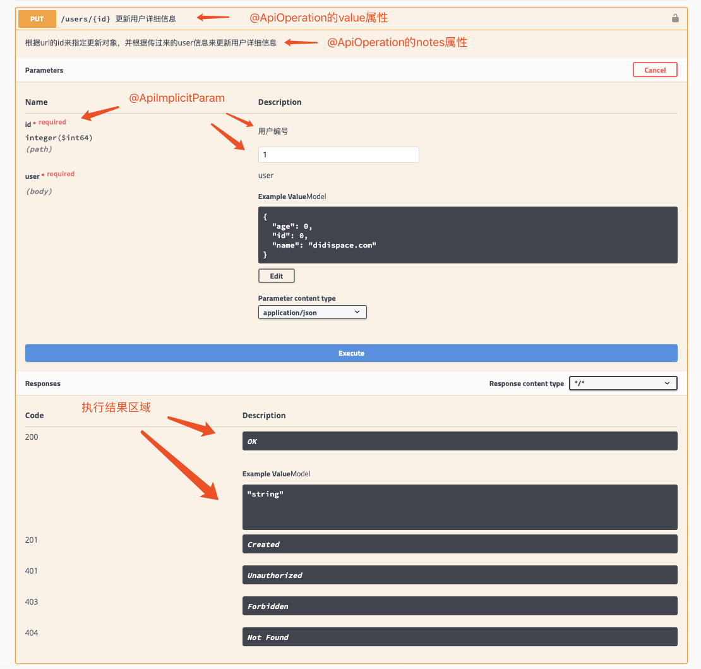
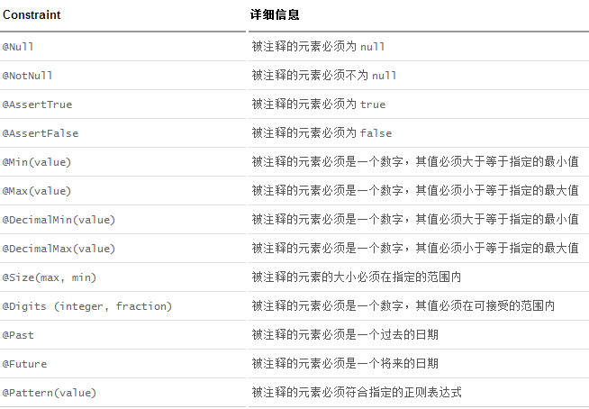




# Spring Boot 2.x 基础教程

# 1 环境搭建

## 1.1 典型package组织方式

```
com  
+- example   
	+- myproject      
		+- Application.java      
		|      
		+- domain      
		|  +- Customer.java      
		|  +- CustomerRepository.java      
		|      
		+- service      
		|  +- CustomerService.java      
		|      
		+- web      
		|  +- CustomerController.java      
```

- `com.example.myproject.domain`包：用于定义实体映射关系与数据访问相关的接口和实现
- `com.example.myproject.service`包：用于编写业务逻辑相关的接口与实现
- `com.example.myproject.web`：用于编写Web层相关的实现，比如：Spring MVC的Controller等 

# 2 配置详解

## 2.1 配置基础

### 2.1.1 YAML

默认配置文件位置为： `src/main/resources/application.properties`

还支持YAML文件，YAML和properites的对比如下

YAML

```yaml
environments:   
	dev:       
		url: http://dev.bar.com        
		name: Developer Setup   
	prod:       
    	url: http://foo.bar.com       
        name: My Cool App
```

properties

```properties
environments.dev.url=http://dev.bar.com
environments.dev.name=Developer Setup
environments.prod.url=http://foo.bar.com
environments.prod.name=My Cool App
```

YAML还可以指定不同的环境用不同的配置

```yaml
server:
  port: 8881
---
spring:
  profiles: test
server:
  port: 8882
---
spring:
  profiles: prod
server:
  port: 8883
```

### 2.1.2 自定义参数@Value和参数引用

YAML

```yaml
book:
	name: xxx
	author: yyy
	desc: ${book.name}
```

JAVA

```java
@Component
public class Book {
 
    @Value("${book.name}")
    private String name;
    @Value("${book.author}")
    private String author;
}
```

`@Value`注解加载属性值的时候可以支持两种表达式来进行配置：

- 一种是我们上面介绍的PlaceHolder方式，格式为 `${...}`，大括号内为PlaceHolder
- 另外还可以使用SpEL表达式（Spring Expression Language）， 格式为 `#{...}`，大括号内为SpEL表达式

### 2.1.3 使用随机数

```yaml
${random.value}
${random.int}
${random.long}
```

### 2.1.4 命令行参数输入

```shell
jave -jar xxx.jar --server.port=8888
```

### 2.1.5 多环境配置

在resource下创建多个文件，文件名格式为

`application-{profile}.properties` 其实`{profile}`对应环境标识

在`application.properties`中通过`sprint.profiles.active`属性来设置不同的profile

### 2.1.6 2.x新特性

#### 1 List类型

一定要连续赋值

```yaml
spring:
	example:
		url:
			- xxx
			- yyy
	example2:
		url: xxx, yyy
```

#### 2 Map类型

```yaml
spring:
	example:
		foo: bar
		hello: world
```

# 3 API开发

## 3.1 构建Restful API

- `@Controller`：修饰class，用来创建处理http请求的对象
- `@RestController`：Spring4之后加入的注解，原来在`@Controller`中返回json需要`@ResponseBody`来配合，如果直接用`@RestController`替代`@Controller`就不需要再配置`@ResponseBody`，默认返回json格式
- `@RequestMapping`：配置url映射。现在更多的也会直接用以Http Method直接关联的映射注解来定义，比如：`GetMapping`、`PostMapping`、`DeleteMapping`、`PutMapping`等

### 1 定义实体类

```java
@Data
public class User {    
    private Long id;
    private String name;
    private Integer age;
}
```

这里使用`@Data`注解可以实现在编译器自动添加set和get函数的效果。该注解是lombok提供的

### 2 定义Controller

```java
@RestController
@RequestMapping(value = "/users")     // 通过这里配置使下面的映射都在/users下
public class UserController {

    // 创建线程安全的Map，模拟users信息的存储
    static Map<Long, User> users = Collections.synchronizedMap(new HashMap<Long, User>());

    /**
     * 处理"/users/"的GET请求，用来获取用户列表
     *
     * @return
     */
    @GetMapping("/")
    public List<User> getUserList() {
        // 还可以通过@RequestParam从页面中传递参数来进行查询条件或者翻页信息的传递
        List<User> r = new ArrayList<User>(users.values());
        return r;
    }

    /**
     * 处理"/users/"的POST请求，用来创建User
     *
     * @param user
     * @return
     */
    @PostMapping("/")
    public String postUser(@RequestBody User user) {
        // @RequestBody注解用来绑定通过http请求中application/json类型上传的数据
        users.put(user.getId(), user);
        return "success";
    }

    /**
     * 处理"/users/{id}"的GET请求，用来获取url中id值的User信息
     *
     * @param id
     * @return
     */
    @GetMapping("/{id}")
    public User getUser(@PathVariable Long id) {
        // url中的id可通过@PathVariable绑定到函数的参数中
        return users.get(id);
    }

    /**
     * 处理"/users/{id}"的PUT请求，用来更新User信息
     *
     * @param id
     * @param user
     * @return
     */
    @PutMapping("/{id}")
    public String putUser(@PathVariable Long id, @RequestBody User user) {
        User u = users.get(id);
        u.setName(user.getName());
        u.setAge(user.getAge());
        users.put(id, u);
        return "success";
    }

    /**
     * 处理"/users/{id}"的DELETE请求，用来删除User
     *
     * @param id
     * @return
     */
    @DeleteMapping("/{id}")
    public String deleteUser(@PathVariable Long id) {
        users.remove(id);
        return "success";
    }

}
```

## 3.2 使用Swagger2构建文档

### 1 整合Swagger2

在`pom.xml`中加入依赖

```xml
<dependency>
    <groupId>com.spring4all</groupId>
    <artifactId>swagger-spring-boot-starter</artifactId>
    <version>1.9.0.RELEASE</version>
</dependency>
```

应用主类中添加`@EnableSwagger2Doc`注解

```java
@EnableSwagger2Doc
@SpringBootApplication
public class Chapter22Application {

    public static void main(String[] args) {
        SpringApplication.run(Chapter22Application.class, args);
    }

}
```

配置文档

```yaml
swagger:
	title:	spring-boot-starter-swagger
	description: Starter for swagger 2.x
	version:	1.4.0.RELEASE
	license:	Apache License, Version 2.0
	licenseUrl:	https://www.apache.org/licenses/LICENSE-2.0.html
	termsOfServiceUrl:	https://github.com/dyc87112/spring-boot-starter-swagger
	contact:
		name:	didi
		url:	http://blog.didispace.com
		email:	dyc87112@qq.com
	base-package:	com.didispace
    base-path:	/**
```

访问接口：http://localhost:8080/swagger-ui.html

### 2 完善文档内容

我们通过`@Api`，`@ApiOperation`注解来给API增加说明、通过`@ApiImplicitParam`、`@ApiModel`、`@ApiModelProperty`注解来给参数增加说明

```java
@Api(tags = "用户管理")
@RestController
@RequestMapping(value = "/users")     // 通过这里配置使下面的映射都在/users下
public class UserController {

    // 创建线程安全的Map，模拟users信息的存储
    static Map<Long, User> users = Collections.synchronizedMap(new HashMap<>());

    @GetMapping("/")
    @ApiOperation(value = "获取用户列表")
    public List<User> getUserList() {
        List<User> r = new ArrayList<>(users.values());
        return r;
    }

    @PostMapping("/")
    @ApiOperation(value = "创建用户", notes = "根据User对象创建用户")
    public String postUser(@RequestBody User user) {
        users.put(user.getId(), user);
        return "success";
    }

    @GetMapping("/{id}")
    @ApiOperation(value = "获取用户详细信息", notes = "根据url的id来获取用户详细信息")
    public User getUser(@PathVariable Long id) {
        return users.get(id);
    }

    @PutMapping("/{id}")
    @ApiImplicitParam(paramType = "path", dataType = "Long", name = "id", value = "用户编号", required = true, example = "1")
    @ApiOperation(value = "更新用户详细信息", notes = "根据url的id来指定更新对象，并根据传过来的user信息来更新用户详细信息")
    public String putUser(@PathVariable Long id, @RequestBody User user) {
        User u = users.get(id);
        u.setName(user.getName());
        u.setAge(user.getAge());
        users.put(id, u);
        return "success";
    }

    @DeleteMapping("/{id}")
    @ApiOperation(value = "删除用户", notes = "根据url的id来指定删除对象")
    public String deleteUser(@PathVariable Long id) {
        users.remove(id);
        return "success";
    }

}

@Data
@ApiModel(description="用户实体")
public class User {

    @ApiModelProperty("用户编号")
    private Long id;
    @ApiModelProperty("用户姓名")
    private String name;
    @ApiModelProperty("用户年龄")
    private Integer age;

}
```




## 3.3 JSR-303实现请求参数校验

### 1 JSR-303标准

JSR是Java Specification Requests的缩写，意思是Java 规范提案。是指向JCP(Java Community Process)提出新增一个标准化技术规范的正式请求。任何人都可以提交JSR，以向Java平台增添新的API和服务。JSR已成为Java界的一个重要标准

JSR-303 是JAVA EE 6 中的一项子规范，叫做Bean Validation，Hibernate Validator 是 Bean Validation 的参考实现

**Bean Validation中内置的constraint**



**Hibernate Validator附加的constraint**


### 2 基本用法

1. 在要校验的字段上添加上`@NotNull`注解

   ```java
   @Data
   @ApiModel(description="用户实体")
   public class User {
   
       @ApiModelProperty("用户编号")
       private Long id;
   
       @NotNull
       @ApiModelProperty("用户姓名")
       private String name;
   
       @NotNull
       @ApiModelProperty("用户年龄")
       private Integer age;
   
   }
   ```

2. 在需要校验的参数实体前添加`@Valid`注解

   ```java
   @PostMapping("/")
   @ApiOperation(value = "创建用户", notes = "根据User对象创建用户")
   public String postUser(@Valid @RequestBody User user) {
       users.put(user.getId(), user);
       return "success";
   }
   ```

3. 出错时回复

   - `timestamp`：请求时间
   - `status`：HTTP返回的状态码，这里返回400，即：请求无效、错误的请求，通常参数校验不通过均为400
   - `error`：HTTP返回的错误描述，这里对应的就是400状态的错误描述：Bad Request
   - `errors`：具体错误原因，是一个数组类型；因为错误校验可能存在多个字段的错误，比如这里因为定义了两个参数不能为`Null`，所以存在两条错误记录信息
   - `message`：概要错误消息，返回内容中很容易可以知道，这里的错误原因是对user对象的校验失败，其中错误数量为`2`，而具体的错误信息就定义在上面的`errors`数组中
   - `path`：请求路径

### 3 依赖库

```xml
<dependency>
    <groupId>org.springframework.boot</groupId>
    <artifactId>spring-boot-starter-validation</artifactId>
</dependency>
```

也可以只依赖下面这个库

```xml
<dependency>
   <groupId>org.hibernate.validator</groupId>
    <artifactId>hibernate-validator</artifactId>
    <version>6.0.14.Final</version>
    <scope>compile</scope>
</dependency>
```


# 4 数据库操作

## 4.1 使用JdbcTemplate访问MySQL数据库

### 1 数据源配置

1. 为了连接数据库需要引入jdbc支持，在`pom.xml`中引入如下配置

   ```xml
   <dependency>
       <groupId>org.springframework.boot</groupId>
       <artifactId>spring-boot-starter-jdbc</artifactId>
   </dependency>
   ```

2. 嵌入式数据库支持(H2，HSQL, Derby)

   ```xml
   <dependency>
       <groupId>org.hsqldb</groupId>
       <artifactId>hsqldb</artifactId>
       <scope>runtime</scope>
   </dependency>
   ```

3. 独立数据库MySql

   pom.xml

   ```xml
   <dependency>
       <groupId>mysql</groupId>
       <artifactId>mysql-connector-java</artifactId>
   </dependency>
   ```

   application.properties

   ```properties
   spring.datasource.url=jdbc:mysql://localhost:3306/test
   spring.datasource.username=dbuser
   spring.datasource.password=dbpass
   spring.datasource.driver-class-name=com.mysql.cj.jdbc.Driver
   ```

### 2 使用JdbcTemplate

#### 1 领域对象

```java
@Data
@NoArgsConstructor
public class User {

    private String name;
    private Integer age;

}
```

使用了Lombok的`@Data`和`@NoArgsConstructor`注解来自动生成各参数的Set、Get函数以及不带参数的构造函数

#### 2 编写Service interface

```java
public interface UserService {

  
    int create(String name, Integer age);

    
    List<User> getByName(String name);

    
    int deleteByName(String name);

    
    int getAllUsers();

    
    int deleteAllUsers();

}
```

#### 3 编写Service的实现，注入JdbcTemplate

Spring Boot下访问数据库的配置依然秉承了框架的初衷：简单。`不需要像Spring应用中创建JdbcTemplate的Bean`，就可以直接在自己的对象中注入使用

```java
@Service
public class UserServiceImpl implements UserService {

    private JdbcTemplate jdbcTemplate;

    UserServiceImpl(JdbcTemplate jdbcTemplate) {
        this.jdbcTemplate = jdbcTemplate;
    }

    @Override
    public int create(String name, Integer age) {
        return jdbcTemplate.update("insert into USER(NAME, AGE) values(?, ?)", name, age);
    }

    @Override
    public List<User> getByName(String name) {
        List<User> users = jdbcTemplate.query("select NAME, AGE from USER where NAME = ?", (resultSet, i) -> {
            User user = new User();
            user.setName(resultSet.getString("NAME"));
            user.setAge(resultSet.getInt("AGE"));
            return user;
        }, name);
        return users;
    }

    @Override
    public int deleteByName(String name) {
        return jdbcTemplate.update("delete from USER where NAME = ?", name);
    }

    @Override
    public int getAllUsers() {
        return jdbcTemplate.queryForObject("select count(1) from USER", Integer.class);
    }

    @Override
    public int deleteAllUsers() {
        return jdbcTemplate.update("delete from USER");
    }
}
```

## 4.2 使用MyBatis访问MySQL

### 1 整合MyBatis

pom.xml

```xml
<dependency>
    <groupId>org.mybatis.spring.boot</groupId>
    <artifactId>mybatis-spring-boot-starter</artifactId>
    <version>2.1.1</version>
</dependency>

<dependency>
    <groupId>mysql</groupId>
    <artifactId>mysql-connector-java</artifactId>
</dependency>
```

application.properties

```properties
spring.datasource.url=jdbc:mysql://localhost:3306/test
spring.datasource.username=root
spring.datasource.password=
spring.datasource.driver-class-name=com.mysql.cj.jdbc.Driver
```

### 2 使用

#### 1 创建映射对象User

```java
@Data
@NoArgsConstructor
public class User {

    private Long id;

    private String name;
    private Integer age;

    public User(String name, Integer age) {
        this.name = name;
        this.age = age;
    }
}
```

#### 2 创建Mapper Interface

```java
@Mapper
public interface UserMapper {

    @Select("SELECT * FROM USER WHERE NAME = #{name}")
    User findByName(@Param("name") String name);

    @Insert("INSERT INTO USER(NAME, AGE) VALUES(#{name}, #{age})")
    int insert(@Param("name") String name, @Param("age") Integer age);

}
```

#### 3 创建Spring Boot 主类

```java
@SpringBootApplication
public class Chapter35Application {

	public static void main(String[] args) {
		SpringApplication.run(Chapter35Application.class, args);
	}

}
```

#### 4 单元测试

```java
@Slf4j
@RunWith(SpringRunner.class)
@SpringBootTest
public class Chapter35ApplicationTests {

    @Autowired
    private UserMapper userMapper;

    @Test
    @Rollback
    public void test() throws Exception {
        userMapper.insert("AAA", 20);
        User u = userMapper.findByName("AAA");
        Assert.assertEquals(20, u.getAge().intValue());
    }

}
```

### 3 注解输入说明

#### 1 使用@Param

```java
@Insert("INSERT INTO USER(NAME, AGE) VALUES(#{name}, #{age})")
int insert(@Param("name") String name, @Param("age") Integer age);
```

`@Param`中定义的`name`对应了SQL中的`#{name}`，`age`对应了SQL中的`#{age}`

#### 2 使用Map

```java
@Insert("INSERT INTO USER(NAME, AGE) VALUES(#{name,jdbcType=VARCHAR}, #{age,jdbcType=INTEGER})")
int insertByMap(Map<String, Object> map);

//使用方法
Map<String, Object> map = new HashMap<>();
map.put("name", "CCC");
map.put("age", 40);
userMapper.insertByMap(map);
```

#### 3 使用对象

```java
@Insert("INSERT INTO USER(NAME, AGE) VALUES(#{name}, #{age})")
int insertByUser(User user);
```

`#{name}`、`#{age}`就分别对应了User对象中的`name`和`age`属性

#### 4 完整的增删改查

```java
public interface UserMapper {

    @Select("SELECT * FROM user WHERE name = #{name}")
    User findByName(@Param("name") String name);

    @Insert("INSERT INTO user(name, age) VALUES(#{name}, #{age})")
    int insert(@Param("name") String name, @Param("age") Integer age);

    @Update("UPDATE user SET age=#{age} WHERE name=#{name}")
    void update(User user);

    @Delete("DELETE FROM user WHERE id =#{id}")
    void delete(Long id);
}
```

### 4 返回结果处理@Results

```java
@Results({
    @Result(property = "name", column = "name"),
    @Result(property = "age", column = "age")
})
@Select("SELECT name, age FROM user")
List<User> findAll();
```

`@Result`中的`property`属性对应User对象中的成员名，`column`对应SELECT出的字段名

## 4.3 使用MyBatis的XML配置方式

### 1 在应用主类中增加mapper的扫描包配置

```java
@MapperScan("com.didispace.chapter36.mapper")
@SpringBootApplication
public class Chapter36Application {

	public static void main(String[] args) {
		SpringApplication.run(Chapter36Application.class, args);
	}

}
```

### 2 创建Map Interface

```java
public interface UserMapper {

    User findByName(@Param("name") String name);

    int insert(@Param("name") String name, @Param("age") Integer age);

}
```

### 3 application.properties指定xml配置

```properties
mybatis.mapper-locations=classpath:mapper/*.xml
```

###  4 创建xml文件

```xml
<?xml version="1.0" encoding="UTF-8" ?>
<!DOCTYPE mapper
        PUBLIC "-//mybatis.org//DTD Mapper 3.0//EN"
        "http://mybatis.org/dtd/mybatis-3-mapper.dtd">
<mapper namespace="com.didispace.chapter36.mapper.UserMapper">
    <select id="findByName" resultType="com.didispace.chapter36.entity.User">
        SELECT * FROM USER WHERE NAME = #{name}
    </select>

    <insert id="insert">
        INSERT INTO USER(NAME, AGE) VALUES(#{name}, #{age})
    </insert>
</mapper>
```

## 4.4 Mabatis事务用法

### 1 @Options选项属性

```java
@Options(useGeneratedKeys = true, keyProperty = "userId")  //获得主键返回值
//其他属性
useCache=true
//为true时表示本条语句将进行二级缓存，仅在select下使用，select下默认为true
    
flushCache=false 
//为true时表示调用任何语句将清空本地缓存和耳机缓存，为flase时不会
//select时默认为false，insert、update、delete时默认为true
    
resultSetType=FORWARD_ONLY
//resultSetType设置结果集的游标怎么滚动
//FORWARD_ONLY表示结果集的游标只能向下移动 
//SCROLL_INSENSITIVE和SCROLL_SENSITIVE都能实现任意前后滚动，区别在于前者对于修改敏感，后者对于修改不敏感
    
statementType=PREPARED
//是否预编译
//STATEMENT 静态SQL
//PREPARED 动态SQL，一次编译，多次执行，可以防止SQL注入
//CALLABLE 动态SQL，支持调用存储过程（还提供了些其他的支持？） 	

fetchSize= -1
//每次读取多少行数据，-1或不设置：驱动来决定

timeout=-1 
//设置驱动程序等待数据库返回请求结果，并抛出异常时间的最大等待值，-1或不设置：驱动来决定

useGeneratedKeys=false
//(仅对 insert 有用)为true时会告诉 MyBatis 使用JDBC的 getGeneratedKeys 方法来取出由数据(比如:像 MySQL 和 SQL Server 这样的数据库管理系统的自动递增字段)内部生成的主键。


keyProperty="userId"
//(仅对 insert 有用)标记一个属性, MyBatis 会通过 getGeneratedKeys 或者通过 insert 语句的 selectKey 子元素设置它的值。默认: 不设置
```

### 2 @MapperScan 和 @Mapper

在不使用@MapperScan前，我们需要直接在Mapper类上面添加注解@Mapper，这种方式要求每一个Mapper类都需要添加此注解，非常麻烦，属于重复劳动。通过使用@MapperScan注解，可以让我们不用为每个Mapper类都添加@Mapper注解。

```java
@SpringBootApplication
@MapperScan("cn.mybatis.mappers","cn.mybatis.mappers.student")
public class SpringbootMybatisDemoApplication {
 
    public static void main(String[] args) {
        SpringApplication.run(SpringbootMybatisDemoApplication.class, args);
    }
}
```

添加@MapperScan("cn.mybatis.mappers")注解以后，cn.mybatis.mappers包下面的接口类，在编译之后都会生成相应的实现类

另外，使用@MapperScan注解可以作用到多个包

### 3 事务管理

添加mybatis-spring-boot-starter依赖时已经加入了事务处理的jar包：spring-tx.jar
在入口处添加@EnableTransactionManagement注解开始事务控制

```java
@Controller
 
@MapperScan("com.fc.mybatistest.mapper")
@EnableTransactionManagement
@SpringBootApplication
public class MybatistestApplication {
	
	@Autowired
	private UserService userService;
 
	public static void main(String[] args) {
		SpringApplication.run(MybatistestApplication.class, args);
	}
	
	@RequestMapping("/")
	public String findAll(Model model){
			...
	}
}
```

然后在业务逻辑层的实现类中添加注解@Transactional

```java

@Transactional(propagation = Propagation.REQUIRED,isolation = Isolation.DEFAULT,timeout=36000,rollbackFor=Exception.class)
public class UserServiceimpl implements UserService {
 
	@Autowired
	private UserMapper userMapper;
	
	@Override
	public List<User> findAll() {
		return userMapper.findAll();
	}
}
```

#### @Transactional各个属性含义

propagation --事务传播行为
含有以下值：

| PROPAGATION_REQUIRED      | 如果当前存在事务，则加入该事务；如果当前没有事务，则创建一个新的事务。这是默认值。 |
| ------------------------- | ------------------------------------------------------------ |
| PROPAGATION_REQUIRES_NEW  | 创建一个新的事务，如果当前存在事务，则把当前事务挂起。       |
| PROPAGATION_NOT_SUPPORTED | 以非事务方式运行，如果当前存在事务，则把当前事务挂起。       |
| PROPAGATION_NEVER         | 以非事务方式运行，如果当前存在事务，则抛出异常。             |
| PROPAGATION_MANDATORY     | 如果当前存在事务，则加入该事务；如果当前没有事务，则抛出异常。 |
| PROPAGATION_NESTED        | 如果当前存在事务，则创建一个事务作为当前事务的嵌套事务来运行；如果当前没有事务，则该取值等价于TransactionDefinition.PROPAGATION_REQUIRED。 |

isolation --事务隔离级别
含有以下值：

| ISOLATION_DEFAULT          | 这是默认值，表示使用底层数据库的默认隔离级别。对大部分数据库而言，通常这值就是READ_COMMITTED |
| -------------------------- | ------------------------------------------------------------ |
| ISOLATION_READ_UNCOMMITTED | 该隔离级别表示一个事务可以读取另一个事务修改但还没有提交的数据。该级别不能防止脏读，不可重复读和幻读，因此很少使用该隔离级别。比如PostgreSQL实际上并没有此级别 |
| ISOLATION_READ_COMMITTED   | 该隔离级别表示一个事务只能读取另一个事务已经提交的数据。该级别可以防止脏读，这也是大多数情况下的推荐值 |
| ISOLATION_REPEATABLE_READ  | 该隔离级别表示一个事务在整个过程中可以多次重复执行某个查询，并且每次返回的记录都相同。该级别可以防止脏读和不可重复读 |
| ISOLATION_SERIALIZABLE     | 所有的事务依次逐个执行，这样事务之间就完全不可能产生干扰，也就是说，该级别可以防止脏读、不可重复读以及幻读。但是这将严重影响程序的性能。通常情况下也不会用到该级别 |


timeout --事务超时


readOnly --读写或只读事务


rollbackFor --指定特定异常实例，遇到时数据回滚


rollbackForClassname--指定特定异常名，遇到时数据回滚


norollbackFor --指定特定异常实例，遇到时数据不会回滚

norollbackForClassname--指定特定异常名，遇到时数据不会回滚

# 5 Java开发神器Lombok的使用与原理

## 1 Lombok的简介

Lombok是一款Java开发插件，使得Java开发者可以通过其定义的一些注解来消除业务工程中冗长和繁琐的代码，尤其对于简单的Java模型对象（POJO）。在开发环境中使用Lombok插件后，Java开发人员可以节省出重复构建，诸如hashCode和equals这样的方法以及各种业务对象模型的accessor和ToString等方法的大量时间。对于这些方法，它能够在编译源代码期间自动帮我们生成这些方法，并没有如反射那样降低程序的性能

pom.xml

```xml
<dependency>
    <groupId>org.projectlombok</groupId>
    <artifactId>lombok</artifactId>
    <version>1.16.8</version>
</dependency>
```

IDEA里需要在设置中启用Build->Compiler->annotation processors

## 2 Lombok常用注解

> [val](https://link.segmentfault.com/?enc=bJ8iO6y8pGrcSwIPiYk9Aw%3D%3D.TcrsCwjVrWFIRMG%2BLTOJgpBye5xhZocXcFMDlefn3%2BmDvZLPOLfIzQm2UKpMaKtZwPMJDtofDGdQx1opVoHiTw%3D%3D)

终于! 无忧无虑的 final 局部变量。

> [var](https://link.segmentfault.com/?enc=Js2CbhFUDU%2BF0b6s9k0NXQ%3D%3D.27RGlpIrBjGt4Vp4PqB4qeorqiZb4T3CJUuqMCW5l3HoPBP8thaS5OsOwrKZelSPP%2FFztzHJK87sWrrXV6G5oA%3D%3D)

可变！类型可变的局部变量

> [@NonNull](https://link.segmentfault.com/?enc=hGD%2BPtrFc%2FSirNfjCMqIIQ%3D%3D.BYhslFDzyVj2IsBTSKIGTSqPrwnpi3gQ4usDhzqTluO3zFOLp61ifYWZmoQ6CRJTzhlsJbG%2BTHxdttlNPpukzQ%3D%3D)

我开始停止了焦虑，爱上了空指针

> [@Getter/@Setter](https://link.segmentfault.com/?enc=6rlIvUhprLCafy2aGjGWgA%3D%3D.g0vdSfcRpOdVgUnRrCNwLsw9x1sOdyV9cUDAA5XGtrdOTvy8BGzCqUtUAZOakf3EsdSIdEtzJC2SrcuuNrgZEUAymD73NyQqDKAV0dR1%2FzI%3D)

再也不用写 `public int getFoo() {return foo;}`了。

> [ToString](https://link.segmentfault.com/?enc=doE8ts8dG0rJ8OT6aSgyng%3D%3D.ObyD42SEwl%2Fuz3z4paRp13mv%2BAx7qevCr8FdCH7xoPWcyNgKd5EYS1xCAyiV8dKsRoDBxiW7S6vpoMGJznwA1SOQTnSk3vaPzjZxrPe9rl4%3D)

没必要启动debugger来查看你的字段：让 lombok来为你生成一个 `ToString` 方法吧！

> [@EqualsAndHashCode](https://link.segmentfault.com/?enc=l9T80uG5F2b1Lsg8ZQ9zXw%3D%3D.XQpsLbEnensrQLBVLOooHaqdKWgbaacc%2FoemK9m9fOA30%2FNWGJ3T13CA0EsqICx3CJ%2BXYD%2F6%2FUiTif29WflpHmVJxszy%2FXKAHLLC5qNTCpw%3D)

让相等变得简单: 从你对象的字段中生成 `hashCode` 和 `equals` 的实现

> [@NoArgsConstructor, @RequiredArgsConstructor and @AllArgsConstructor](https://link.segmentfault.com/?enc=QPWnjJgW2mk6R%2Bi8oXV9dw%3D%3D.MQ%2FFy6pgUsaJLA7zT1I4M%2F7wc6KIPym5oQSK%2Fl0mPp1hmUbeghAZkENHus02MaMbNeFDjexjhAVPmehL5N44mbhS%2FDvkX0kzg4i6LlVDELbvqgaAjYHy%2BPs0I2cZoyW6%2F2uYtOtJsxIzeAo46Hd5URjWe6pAxmZLWyCpWTf8%2BPk%3D)

按需生成构造函数: 生成不带参数的， 每个 final/non-null 字段一个参数的，一个字段一个参数的构造函数。

> [@Data](https://link.segmentfault.com/?enc=B2Yq3Q%2B7XCC5Y3lnICYLiQ%3D%3D.hy9QvPc9vpokGvbCLgWp4QB53hNN6s4sCqMXu%2FEubuhMen%2BeuZTFPeheeLEQoc64zjkO%2BCDK3011lj025OoP4Q%3D%3D)

所有的都合到一起：`@ToString`，`@ EqualsAndHashCode`，所有字段的 `@Getter`，所有非 final 字段的 `@Setter` 和 `@RequiredArgsConstructor` 的快捷方式！

> [@Value](https://link.segmentfault.com/?enc=FQv4qigU%2BWuwwjc7ZcZCPA%3D%3D.sOkravBqSZ8Y2nbRynLk3mKDc6qZmeojNiN%2BHY0Jo98QG1LD%2BHiiSw2vjWI6n%2FdMrgK1mg7XI1UmzUCpV2w%2FnQ%3D%3D)

让不可变类变得非常容易。

> [@Builder](https://link.segmentfault.com/?enc=kh772N1Fg3nFHSCx9od%2FFQ%3D%3D.4YtWPqSDab%2Fva7xPynVzaoFCR6fvLIPOJ41z8SfWHt1o8odtIFIyj190yC3fYpfY71d6Trbi1AN5RRZtDbLdRw%3D%3D)

... and Bob's your uncle: No-hassle fancy-pants APIs for object creation!

> [@SneakyThrows](https://link.segmentfault.com/?enc=hy6L3ja62rHf9lendtyUag%3D%3D.q2TxMMddDoDGNcw7OaexrlHbAWxkcSyaSyla3nsqyetreCGn7yoncssBe1GQBavidGnIoegSui1u1TdbrwLaVO0lThsUx994xNkuet%2Feb4I%3D)

大胆抛出以前没有人抛出的已检查异常！

> [@Synchronized](https://link.segmentfault.com/?enc=nWcUeO%2B9x6mwpoJR4nEOkQ%3D%3D.uiu%2BSkJ0ANIDiX35bDi9QOt%2BXhFF14uOxVCx94z%2BuEqUaJRTxDo4m93qVrqHsSIYRoxsZUEPbOjzWuR4cskmc7yZmQ%2FsVVNymFGebYa4dQg%3D)

`synchronized` 做了正确的事：不要暴露你的锁。

> [@Getter(lazy=true)](https://link.segmentfault.com/?enc=8pL%2Bi0b%2FZ4GcI1YIUGau7g%3D%3D.l60S2ll0Y9pnLqvm0BDG5Ox0Uty6%2FXQlOkeOrbjolA1csh8gc92cg8FK735UyS3NHgCxAC%2FaP6YvzY0Nv4frtfxMXvzDM5%2BlmspUp2bm3PE%3D))

惰性加载是一种美德!

> [@Log](https://link.segmentfault.com/?enc=Zylzigt2hnh0oD2Q1Z5oEg%3D%3D.nIvexjxciKxGB%2Fk676zKb5E0tDs2bcaNWEHPlkfPO%2F0F1Hm4xO7aaX1K1xrBr8rX9VnfSemegYWfYYwmrsaN2DMHNXs97SIi1FHpPll8drk%3D))

Captain's Log, stardate 24435.7: "What was that line again?"

> [experimental](https://link.segmentfault.com/?enc=PEzfOhSLoJbAz%2BYzWIpXQg%3D%3D.t9xhc4HyU9TeqHOFYBckYAh%2FoDfYIjoEiffUeA6qH98L4fQdsjDshpzntfSzdf0drjKK856TLurRSgP5P6S2yA%3D%3D)

Head to the lab: The new stuff we're working on.




